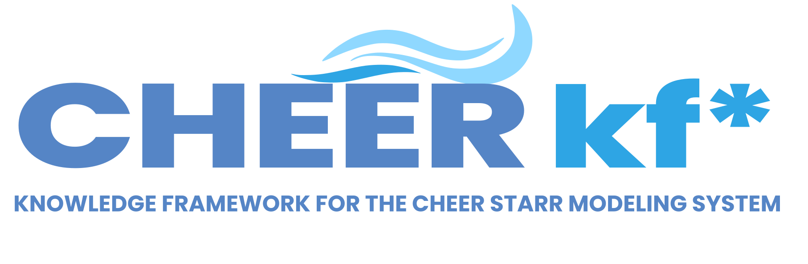

{ width="560" }

# CHEER kf*: Knowledge Framework for the STARR modeling system

**STARR** (Stakeholder-based Tool for the Analysis of Regional Risk) is the integrated model at the centre of the
**CHEER Hub** (Coastal Hazards, Equity, Economic prosperity and Resilience), an NSF Coastlines and People (CoPe)
project led by the University of Delaware. It links hurricane hazard scenarios, a household-housing inventory,
a component-based damage model and long-term loss time series to models of household, insurer and government
decisions.

This site is the user and developer guide to the framework and the front door to its code, data and documentation.
It replaces and extends the earlier [Knowledge Framework site](https://cheer-hub.github.io/cheerkf/).

!!! note "Draft"
    This is a working draft prepared by the Knowledge Framework thrust in September 2026. Items marked
    to be confirmed are waiting on the person named on that page. Nothing here has been
    released publicly yet.

<figure markdown>
{ width="100%" }
<figcaption>The chain that feeds STARR. Click a module below for what it does and where its code and data live.</figcaption>
</figure>

## The chain in one line each

| Module | What it does | Point person |
|---|---|---|
| [H. Hazard scenarios](modules/hazards.md) | Synthetic hurricanes, screened and run through high-resolution wind, surge, inland-flood and rain models, with annual probabilities | Hazards thrust |
| [I. Household-housing inventory](modules/inventory.md) | Every building in the study region with its attributes, archetype, resistance level and households | Buildings thrust |
| [D. Damage model (CHEERsafe)](modules/damage.md) | Damage-probability lookup tables by archetype and resistance level | Buildings thrust |
| [L. Losses](modules/losses.md) | Loss for each building in each scenario | Integration thrust |
| [T. Time series of losses](modules/timelines.md) | Multi-year hurricane and loss timelines with occurrence probabilities | Integration thrust |
| [STARR decision models](modules/starr.md) | Households, insurers and government on an annual time step | Integration thrust |

## Where to go next

- **Using the framework**: [Getting started](getting-started.md), then [Examples](examples.md).
- **Finding a dataset or repository**: the [Catalog](catalog.md).
- **Which versions go together**: [Versions and compatibility](versions.md).
- **Extending or fixing something**: [Contributing](contributing.md).
- **Asking a question**: [Community](community.md).
- **Getting access, publishing data, running on DesignSafe**: [Procedures](procedures/index.md).
- **The thrusts' own technical pages**: [Reference](reference/index.md).
