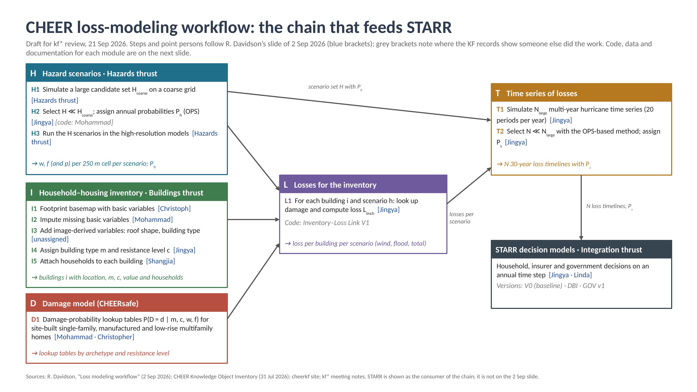

# Workflow overview

The figure below is the reference diagram for the framework. Blue brackets name the point person on the
Buildings-thrust workflow slide of 2 September 2026; grey brackets note where the records show someone else did the work.

{ width="100%" }

## Notation

| Symbol | Meaning |
|---|---|
| h | a hurricane scenario; H is the selected set, Ph its annual occurrence probability |
| i | a building in the inventory |
| m, c | building archetype (type) and resistance level used by CHEERsafe |
| w, f, p | wind speed, flood depth and precipitation at a building for scenario h |
| D = d | damage state |
| Limch | loss for building i of type m and resistance c in scenario h |
| s | a multi-year timeline of hurricanes; Ps its probability |

## How the modules connect

1. **H** produces hazard fields for each selected scenario and its probability.
2. **I** produces the list of buildings with the attributes CHEERsafe needs.
3. **D** produces lookup tables that turn hazard at a building into damage and loss ratio.
4. **L** overlays I on H, applies D, and stores Limch for every building and scenario.
5. **T** draws multi-year timelines from H and L and reduces them to a set STARR can run.
6. **STARR** consumes the timelines and the inventory dynamics.

Each module page lists inputs, outputs, code, data, documentation, versions and open items.
